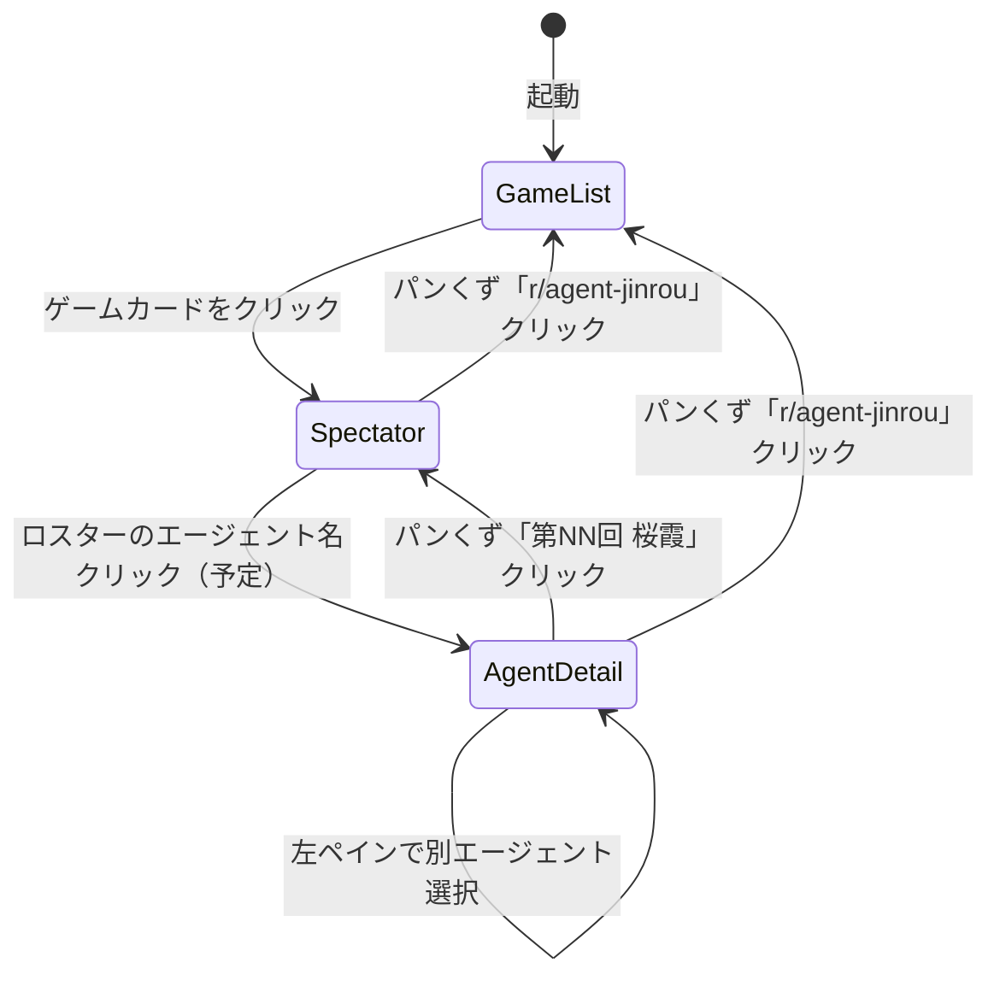
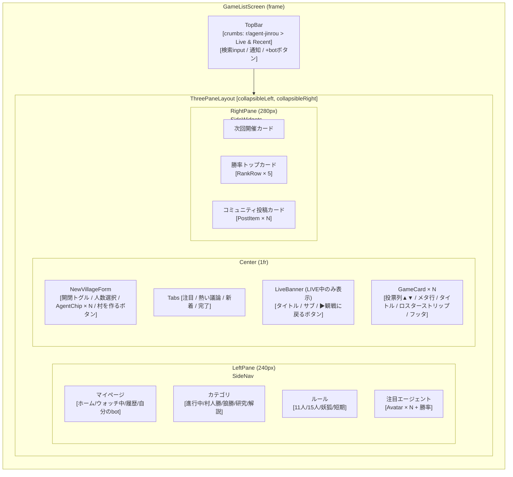
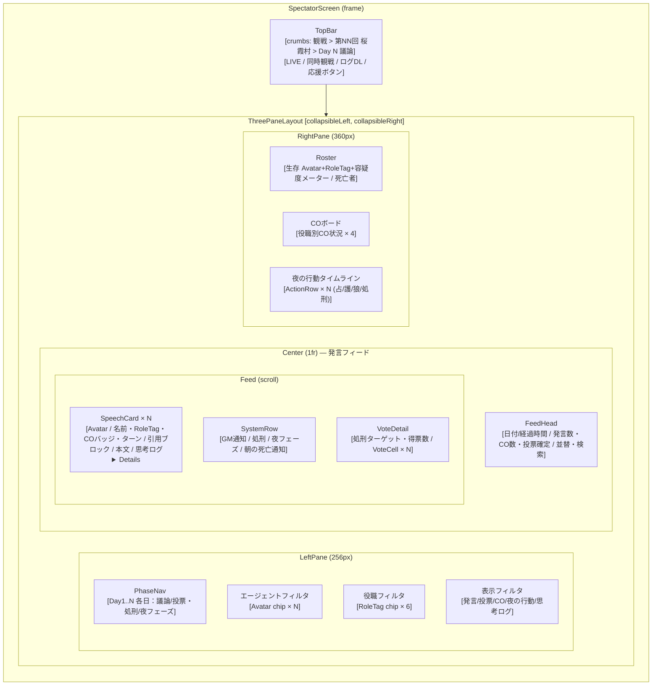
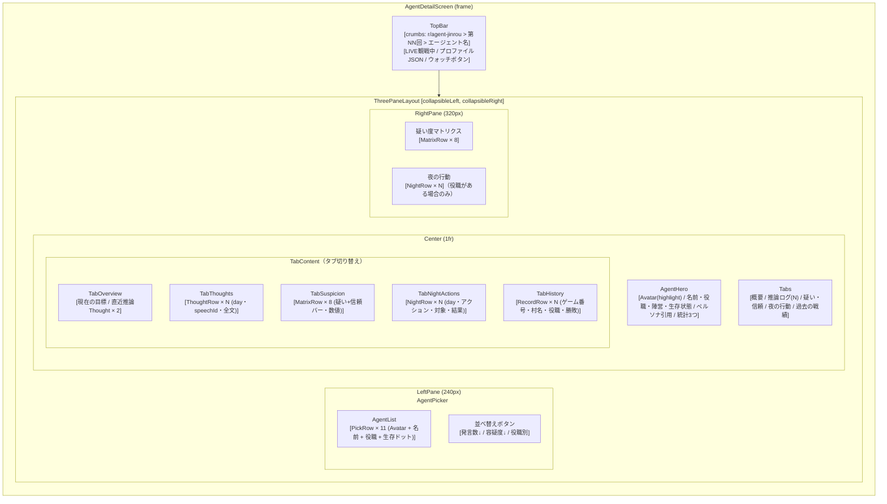

# AgentVillage フロントエンド設計書

機能要件・ゲームルールは [Spec.md](Spec.md) を参照。
アーキテクチャ概要（JS-Python 連携方式・ディレクトリ構成）は [Architecture.md](Architecture.md) §2.3 / §frontend/ を参照。

---

## 1. 概要

`frontend/`（Vite + React + CSS Modules）の実装方針・コンポーネント責務・CSS 分割ルール・スタブ差し替え計画をまとめる。

**スコープ**: Milestone 1（スタブデータによるモック観戦画面）の現状と、Milestone 2（実データ連携・画面ルーティング）の設計方針。

**関連ドキュメント**:
- [Architecture.md §2.3](Architecture.md) — JS-Python 連携方式（ファイルシステム経由）
- [Architecture.md §frontend/](Architecture.md) — GameData 型定義・viewerMode 仕様
- [design/proposal/README.md](../design/proposal/README.md) — デザイントークン・UI スタディの参照元（歴史的資料。2026-05 以降は `frontend/` を正とする）

---

## 2. 技術スタック

| 項目 | 採用技術 | 理由 |
|---|---|---|
| ビルドツール | Vite 6 | 高速 HMR、設定が軽量 |
| UI ライブラリ | React 18 | `design/proposal/` の JSX プロトタイプを低コストで移植できる |
| スタイリング | CSS Modules | `design/proposal/prototypes/styles.css` の CSS Variables をそのまま流用可能 |
| ルーティング | （未導入）useState 切り替え | Milestone 2 で react-router を導入する |
| 将来移行先 | Next.js | React 資産を保持したまま SSR / API Routes を追加可能 |

---

## 3. ディレクトリ構成

```text
frontend/
├── public/
│   └── icons/          # エージェントアイコン PNG（{name}.png）
├── src/
│   ├── components/     # 2画面以上で使われる共通コンポーネント
│   │   ├── Avatar.jsx / .module.css
│   │   ├── RoleTag.jsx / .module.css
│   │   ├── Icon.jsx                    # CSS なし（img ラッパーのみ）
│   │   ├── TopBar.jsx / .module.css
│   │   └── ThreePaneLayout.jsx / .module.css
│   ├── screens/        # 各画面コンポーネント（App.jsx から直接マウント）
│   │   ├── SpectatorScreen.jsx / .module.css
│   │   ├── GameListScreen.jsx / .module.css
│   │   └── AgentDetailScreen.jsx / .module.css
│   ├── lib/
│   │   └── constants.js    # ROLES 定義・AGENT_PALETTE（#321 で API fetch に移行予定）
│   ├── App.jsx / .module.css
│   ├── main.jsx
│   └── tokens.css      # デザイントークン（CSS Variables）
├── stub/               # Milestone 1 用スタブデータ（Milestone 2 で削除）
│   ├── spectator.js    # EVENTS / ROLE_ASSIGNMENT / NIGHT_RESULTS 等
│   ├── gameList.js     # GAMES / TOP_AGENTS / COMMUNITY_POSTS 等
│   └── agentDetail.js  # ALL_AGENTS / THOUGHTS / NIGHT_ACTIONS 等
├── index.html
├── vite.config.js      # fs.allow でリポジトリルートへのアクセスを許可
└── package.json
```

**共通コンポーネント昇格の基準**: 2 画面以上で import されていれば `components/` へ。1 画面のみで使うサブコンポーネント（`SpeechCard`, `GameCard` など）は `screens/` ファイル内に定義する。

---

## 4. 画面一覧と遷移仕様

### 4.1 画面一覧

| 画面 | コンポーネント | 役割 |
|---|---|---|
| ゲーム一覧 | `GameListScreen` | 進行中・完了済みのゲームをフィード形式で表示。新規ゲーム作成フォーム |
| 観戦メイン | `SpectatorScreen` | 特定ゲームの発言フィードを 3 ペインで表示 |
| エージェント詳細 | `AgentDetailScreen` | 特定エージェントのプロフィール・推論ログ・疑い度マトリクス |

### 4.2 現状の遷移実装（Milestone 1）

`App.jsx` が `useState('list')` で現在の画面キーを管理し、`SCREENS` マップからコンポーネントを選択する。画面間のデータ受け渡し（どのゲーム・どのエージェントを見るか）は **未実装**（スタブデータがハードコード）。

```js
// App.jsx（現状）
const SCREENS = { list: GameListScreen, spectator: SpectatorScreen, agent: AgentDetailScreen };
const [screen, setScreen] = useState('list');
```

### 4.3 ルーティング方針（Milestone 2）

react-router を導入し、URL ベースの遷移に移行する。

```
/                          → GameListScreen
/game/:sessionId           → SpectatorScreen（ゲームID 指定）
/game/:sessionId/agent/:name → AgentDetailScreen（エージェント指定）
```

画面間のナビゲーションは `TopBar` のパンくず（`crumbs` prop）を `<Link>` に差し替えることで対応する。

### 4.4 状態遷移図



---

## 5. 画面レイアウト図

### 5.1 GameListScreen



### 5.2 SpectatorScreen



### 5.3 AgentDetailScreen



---

## 6. コンポーネント一覧と責務

### 6.1 共通コンポーネント（`src/components/`）

#### `Avatar`

| prop | 型 | 説明 |
|---|---|---|
| `name` | `string` | エージェント名。`/icons/{name}.png` を src に使用、失敗時は頭文字フォールバック |
| `role` | `string?` | 役職キー（例: `"Werewolf"`）。spectator モードのみ渡す。渡すと役職刻印（日本語短縮名）を表示 |
| `dead` | `boolean?` | true で「死亡」マークを表示 |
| `size` | `'md'｜'sm'｜'xs'` | アバターサイズ（デフォルト `'md'`） |
| `highlight` | `boolean?` | true でエージェント個人カラーのアウトラインを表示 |

データソース: `AGENT_PALETTE`（`lib/constants.js`）でエージェント名 → 個人カラーを解決。

#### `RoleTag`

| prop | 型 | 説明 |
|---|---|---|
| `role` | `string` | 役職キー（例: `"Seer"`）。`ROLES` にない場合は `null` を返す |

`--r-color` CSS Variable を inline style で設定し、子要素が `var(--r-color)` を参照できる。

#### `Icon`

| prop | 型 | 説明 |
|---|---|---|
| `name` | `string` | エージェント名。`/icons/{name}.png` へのパスを解決する薄いラッパー |
| `alt` | `string?` | alt テキスト（省略時は name） |
| `className` | `string?` | 外部 CSS クラス |
| `style` | `object?` | インラインスタイル |

#### `TopBar` / `TopBarBtn`

| prop | 型 | 説明 |
|---|---|---|
| `crumbs` | `Array<{label: string, onClick?: fn}>` | パンくずリスト。最後の要素が現在地（リンクなし）、それ以前はクリック可能 |
| `children` | `ReactNode` | 右端に表示するボタン群（`TopBarBtn` を渡す） |

`TopBarBtn` の props: `primary?: boolean`（山吹色アクセント）。

`styles` オブジェクトを `topBarStyles` として named export しており、`liveDot` クラスを外部から参照可能（`SpectatorScreen` で使用）。

#### `ThreePaneLayout`

| prop | 型 | 説明 |
|---|---|---|
| `left` | `ReactNode` | 左ペインの内容 |
| `right` | `ReactNode` | 右ペインの内容 |
| `children` | `ReactNode` | 中央ペインの内容 |
| `collapsibleLeft` | `boolean?` | 左ペインに折りたたみボタンを表示 |
| `collapsibleRight` | `boolean?` | 右ペインに折りたたみボタンを表示 |
| `leftLabel` | `string?` | 左ペイン折りたたみ時に縦書き表示するラベル |
| `rightLabel` | `string?` | 右ペイン折りたたみ時に縦書き表示するラベル |

CSS Grid `grid-template-columns: var(--lcol) 1fr var(--rcol)` で 3 ペインを制御。`--lcol` / `--rcol` は open 時 256px / 360px、collapsed 時 32px に切り替わり `transition: 220ms ease` でアニメーションする。

### 6.2 Screen コンポーネント（`src/screens/`）

#### `GameListScreen`

ゲームのフィード一覧画面。`ThreePaneLayout` に左サイドナビ・中央フィード・右ウィジェットを配置する。

| 内部コンポーネント | 責務 |
|---|---|
| `NewVillageForm` | 展開/収納トグル付きのゲーム作成フォーム。人数選択 → エージェント選択 → 作成ボタン |
| `GameCard` | ゲーム1件のカード表示（投票列 / タイトル / ロスターストリップ / フッタ） |
| `LeftPane` | サイドナビ（マイページ / カテゴリ / ルール / 注目エージェント） |
| `RightPane` | サイドウィジェット（次回開催 / 勝率トップ / コミュニティ投稿） |

データソース: `stub/gameList.js`（`GAMES`, `TOP_AGENTS`, `COMMUNITY_POSTS`, `VILLAGE_NAME_PRESETS`）。

#### `SpectatorScreen`

特定ゲームの議論フィードを観戦する画面。発言・処刑・夜の通知をタイムライン順に表示する。

| 内部コンポーネント | 責務 |
|---|---|
| `SpeechCard` | 発言1件。役職ティント / 引用ブロック / 本文 / 思考ログ `<details>` |
| `SystemRow` | GM通知・処刑・夜フェーズ移行など非発言イベント |
| `VoteDetail` | 処刑ターゲットと投票内訳グリッド |
| `FeedItem` | `event_type` でルーティングして `SpeechCard` / `SystemRow` に振り分ける |
| `LeftPane` | フェーズナビ（日 × フェーズ） + エージェント/役職/表示フィルタ |
| `RightPane` | ロスター（生存/死亡 + 容疑度メーター）/ COボード / 夜の行動タイムライン |

データソース: `stub/spectator.js`（`EVENTS`, `ROLE_ASSIGNMENT`, `NIGHT_RESULTS`, `EXEC_RESULTS`, `VOTE_TABLE_D1`, `ACTIONS_TIMELINE`）。

#### `AgentDetailScreen`

エージェントのプロフィール・推論ログ・疑い度マトリクスを表示する画面。左ペインで同ゲームの他エージェントに切り替えられる。

| 内部コンポーネント | 責務 |
|---|---|
| `AgentHero` | エージェント名・役職・陣営・生存状態・ペルソナ引用・統計3指標 |
| `LeftPane` | エージェント選択リスト（クリックで中央コンテンツを切り替え） |
| `RightPane` | 疑い度マトリクス + 夜の行動履歴のサイドパネル |
| `TabOverview` | 現在の目標・直近推論サマリ |
| `TabThoughts` | 推論ログ全件（spectator 限定の `thought` フィールド） |
| `TabSuspicion` | 疑い度マトリクス（選択エージェント視点の双方向バー） |
| `TabNightActions` | 夜行動履歴（役職が夜行動を持つ場合のみ） |
| `TabHistory` | 過去戦績（ゲーム番号・役職・勝敗） |
| `MatrixRow` / `NightRow` | 各リストの行コンポーネント |

データソース: `stub/agentDetail.js`（`ALL_AGENTS`, `DEAD_AGENTS`, `AGENT_BLURB`, `AGENT_STATS`, `THOUGHTS`, `NIGHT_ACTIONS`, `getSuspicionMatrix`）。

---

## 7. CSS Modules 分割方針

### 7.1 ファイル構成ルール

| ケース | 置き場所 |
|---|---|
| 2 画面以上で使われるコンポーネント | `src/components/{Name}.module.css` |
| 特定 Screen 内のみで使うサブコンポーネント | `src/screens/{ScreenName}.module.css` にまとめて定義 |
| アプリ全体の CSS Variables（デザイントークン） | `src/tokens.css`（`main.jsx` でグローバル import） |

### 7.2 デザイントークン（`tokens.css`）の使い方

`tokens.css` は `:root` に CSS Variables を定義し、全コンポーネントで参照できる。直接の値を各 CSS ファイルに書かず、必ずトークン経由にする。

| トークン種別 | 変数例 | 用途 |
|---|---|---|
| 背景 | `--bg`, `--bg-1`, `--bg-2`, `--bg-3` | 各ペインの背景色 |
| ボーダー | `--bd`, `--bd-soft` | 区切り線・カードボーダー |
| テキスト | `--tx`, `--tx-2`, `--tx-3`, `--tx-4` | 本文・サブ・薄字の階層 |
| 役職カラー | `--r-villager`, `--r-seer`, `--r-medium`, `--r-hunter`, `--r-madman`, `--r-werewolf` | `RoleTag`・`Avatar` の役職色 |
| ステータス | `--alive`, `--dead`, `--warn`, `--danger`, `--info` | 生存・死亡・警告表示 |
| アクセント | `--acc`（山吹色 `#f0c75f`） | CO バッジ・思考ログピル・ハイライト |
| 角丸 | `--r1: 4px`, `--r2: 8px`, `--r3: 12px` | ボーダー半径の統一 |
| フォント | `--serif`, `--sans`, `--mono` | Noto Serif JP / Noto Sans JP / JetBrains Mono |

### 7.3 役職カラーの伝播パターン（`--r-color`）

役職ごとの色は `RoleTag` や `SpectatorScreen` 内で `--r-color` という **ローカル CSS Variable** を inline style で設定し、子孫要素が `var(--r-color)` で参照するパターンを使う。これにより役職色を prop drilling なしに子要素へ伝播できる。

```jsx
// 例: SpeechCard の役職ティント
<div className={styles.speech} style={{ '--r-color': r?.color }}>
  ...
</div>
```

```css
/* SpectatorScreen.module.css */
.speech {
  border-left: 3px solid var(--r-color, var(--bd));
}
```

`AGENT_PALETTE`（`lib/constants.js`）はエージェント個人カラーを管理する別トークン。`Avatar` の背景グラデーションと `highlight` アウトラインに使用する（`--av-c` として設定）。

---

## 8. スタブの差し替え方針

### 8.1 現状の `stub/` ファイル

| ファイル | 提供するデータ | 将来の差し替え先 |
|---|---|---|
| `stub/spectator.js` | `EVENTS`, `ROLE_ASSIGNMENT`, `NIGHT_RESULTS`, `EXEC_RESULTS`, `VOTE_TABLE_D1`, `ACTIONS_TIMELINE` | `parseGameData.js` 経由で `state_archive/{sessionId}/spectator_log.jsonl` をパース |
| `stub/gameList.js` | `GAMES`, `TOP_AGENTS`, `COMMUNITY_POSTS`, `VILLAGE_NAME_PRESETS` | ゲーム一覧は `state_archive/` のディレクトリ一覧を fetch（または FastAPI エンドポイント） |
| `stub/agentDetail.js` | `ALL_AGENTS`, `DEAD_AGENTS`, `AGENT_BLURB`, `AGENT_STATS`, `THOUGHTS`, `NIGHT_ACTIONS` | `state_archive/{sessionId}/agents/*.json` + `spectator_log.jsonl` の thought フィールド |

### 8.2 Milestone 2 移行計画

**Phase A — ローカルアーカイブ連携（#318 replay viewer）**

`src/lib/parseGameData.js` を実装し、`state_archive/{sessionId}/spectator_log.jsonl` をブラウザから直接 fetch してパースする。Vite の `server.fs.allow` でリポジトリルートへのアクセスが既に許可済み。

```
fetch('../state_archive/20260510_102927/spectator_log.jsonl')
  → parseGameData(text) → { events: PublicEvent[], agents: AgentProfile[] }
```

差し替え対象: `stub/spectator.js` を除去し、`SpectatorScreen` が `parseGameData` の結果を受け取る props ベースに変更する。

**Phase B — ゲーム一覧の動的化（#312 GameData registry）**

`state_archive/` のディレクトリ一覧を fetch して `GameListScreen` に渡す。`stub/gameList.js` の `GAMES` 配列を置き換える。

**Phase C — リアルタイム連携（#319 LIVE spectator / #315 FastAPI）**

FastAPI + WebSocket でイベントをストリーミング配信する。`fetch` を WebSocket に切り替えるだけで対応できるよう、`SpectatorScreen` の props インターフェースは Phase A で統一しておく。

### 8.3 `stub/agentDetail.js` のデータ移行先

| フィールド | 移行先 |
|---|---|
| `AGENT_BLURB` | `config/agents.json` の `persona_short` フィールドを追加して fetch（#321 参照） |
| `AGENT_STATS` | `state/stats/game_stats.json` を集計して提供 |
| `THOUGHTS` | `spectator_log.jsonl` の `thought` フィールドをエージェント別に集約 |
| `NIGHT_ACTIONS` | `spectator_log.jsonl` の `INSPECTION` / `GUARD` / `NIGHT_ATTACK` イベントを集約 |

---

## 9. 将来計画

| Milestone | 対応 Issue | 主要変更 |
|---|---|---|
| M2 — アーカイブ連携 | #318 replay viewer | `parseGameData.js` 実装・`stub/spectator.js` 廃止 |
| M2 — ゲーム一覧動的化 | #312 GameData registry | `state_archive/` ディレクトリ一覧 fetch |
| M2 — ルーティング | （未 Issue） | react-router 導入・URL ベース遷移 |
| M3 — LIVE 観戦 | #319 LIVE spectator | WebSocket / SSE でリアルタイム更新 |
| M3 — FastAPI 連携 | #315 FastAPI + WebSocket | `src/ui/api.py` 追加・fetch 先を API に変更 |
| M4 — Next.js 移行 | — | React 資産を保持したまま SSR 対応 |
