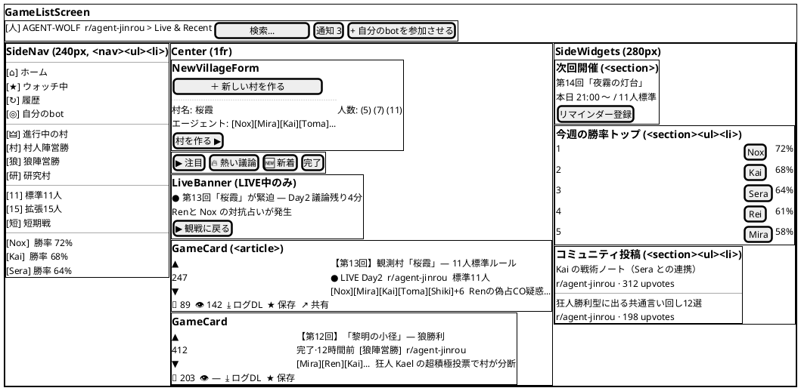
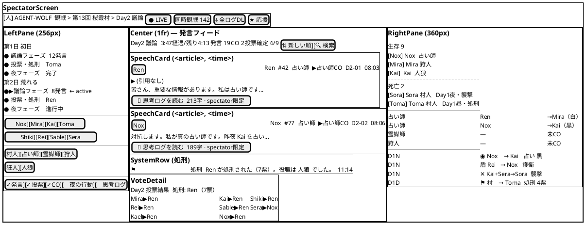
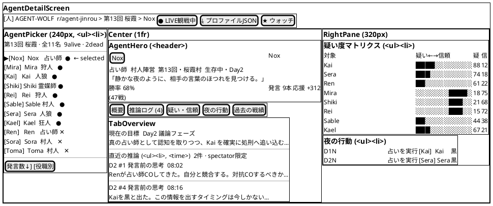

# AgentVillage フロントエンド設計書

機能要件・ゲームルールは [Spec.md](Spec.md) を参照。
アーキテクチャ概要（JS-Python 連携方式・ディレクトリ構成）は [Architecture.md](Architecture.md) §2.3 / §frontend/ を参照。

---

## 1. 概要

`frontend/`（Vite + React + CSS Modules）の実装方針・コンポーネント責務・CSS 分割ルール・スタブ差し替え計画をまとめる。

**スコープ**: Milestone 1（スタブデータによるモック観戦画面）の現状と、Milestone 2（実データ連携・画面ルーティング）の設計方針。

**関連ドキュメント**:
- [Architecture.md §2.3](Architecture.md) — JS-Python 連携方式（ファイルシステム経由）
- [Architecture.md §frontend/](Architecture.md) — GameData 型定義・viewerMode 仕様
- [design/proposal/README.md](../design/proposal/README.md) — デザイントークン・UI スタディの参照元（歴史的資料。2026-05 以降は `frontend/` を正とする）

---

## 2. 技術スタック

| 項目 | 採用技術 | 理由 |
|---|---|---|
| ビルドツール | Vite 6 | 高速 HMR、設定が軽量 |
| UI ライブラリ | React 18 | `design/proposal/` の JSX プロトタイプを低コストで移植できる |
| スタイリング | CSS Modules | `design/proposal/prototypes/styles.css` の CSS Variables をそのまま流用可能 |
| ルーティング | React Router v7（`react-router-dom`） | URL ベース遷移・ブラウザ履歴対応（#342） |
| 将来移行先 | Next.js | React 資産を保持したまま SSR / API Routes を追加可能 |

---

## 3. ディレクトリ構成

```text
frontend/
├── public/
│   └── icons/          # エージェントアイコン PNG（{name}.png）
├── src/
│   ├── components/     # 2画面以上で使われる共通コンポーネント
│   │   ├── Avatar.jsx / .module.css
│   │   ├── RoleTag.jsx / .module.css
│   │   ├── Icon.jsx                    # CSS なし（img ラッパーのみ）
│   │   ├── TopBar.jsx / .module.css
│   │   └── ThreePaneLayout.jsx / .module.css
│   ├── screens/        # 各画面コンポーネント（App.jsx から直接マウント）
│   │   ├── SpectatorScreen.jsx / .module.css
│   │   ├── GameListScreen.jsx / .module.css
│   │   └── AgentDetailScreen.jsx / .module.css
│   ├── lib/
│   │   ├── constants.js    # ROLES 定義・AGENT_PALETTE（#321 で API fetch に移行予定）
│   │   ├── feedFilter.js   # filterFeedEvents(events, day, phase) — フェーズ別フィルタ純粋関数
│   │   └── feedFilter.test.js
│   ├── App.jsx / .module.css
│   ├── main.jsx
│   └── tokens.css      # デザイントークン（CSS Variables）
├── stub/               # Milestone 1 用スタブデータ（Milestone 2 で削除）
│   ├── spectator.js    # EVENTS / ROLE_ASSIGNMENT / NIGHT_RESULTS 等
│   ├── gameList.js     # GAMES / TOP_AGENTS / COMMUNITY_POSTS 等
│   └── agentDetail.js  # ALL_AGENTS / THOUGHTS / NIGHT_ACTIONS 等
├── index.html
├── vite.config.js      # fs.allow でリポジトリルートへのアクセスを許可
└── package.json
```

**共通コンポーネント昇格の基準**: 2 画面以上で import されていれば `components/` へ。1 画面のみで使うサブコンポーネント（`SpeechCard`, `GameCard` など）は `screens/` ファイル内に定義する。

---

## 4. 画面一覧と遷移仕様

### 4.1 画面一覧

| 画面 | コンポーネント | 役割 |
|---|---|---|
| ゲーム一覧 | `GameListScreen` | 進行中・完了済みのゲームをフィード形式で表示。新規ゲーム作成フォーム |
| 観戦メイン | `SpectatorScreen` | 特定ゲームの発言フィードを 3 ペインで表示 |
| エージェント詳細 | `AgentDetailScreen` | 特定エージェントのプロフィール・推論ログ・疑い度マトリクス |

### 4.2 現状の遷移実装（#342 完了後）

React Router v7 を導入済み。`App.jsx` は `Routes`/`Route` でルートを定義し、`useState` による画面切り替えは廃止。

```js
// App.jsx
<Routes>
  <Route path="/"                               element={<GameListScreen />} />
  <Route path="/agent/:agentName"               element={<AgentDetailScreen />} />
  <Route path="/game/:sessionId"                element={<SpectatorScreen />} />
  <Route path="/game/:sessionId/agent/:agentName" element={<AgentDetailScreen />} />
  <Route path="*"                               element={<NotFoundScreen />} />
</Routes>
```

`AgentDetailScreen` は `useParams()` の `sessionId` の有無でモードを切り替える:
- **game-scoped mode** (`sessionId` あり): 特定ゲームの推論ログ・疑念マトリクス等を表示
- **global profile mode** (`sessionId` なし): エージェントのグローバルプロフィール・過去戦績を表示。出所は `state/stats/game_stats.json`（横断戦績、`doc/DataSpec.md` §6 のスキーマ）を集計する。`game-scoped mode` が1ゲーム内の役職・推論を見せるのに対し、こちらは勝率・通算成績などゲーム横断の数字を見せる

`NotFoundScreen` は no-match URL 用の 404 fallback。`/foo`、`/game`、`/game/` のように上記4ルートへマッチしない URL では白画面にせず、404 表示と `/` への戻り導線を出す。404 用の狼アイコンは `frontend/public/icons/not-found-wolf.png`、favicon は `frontend/public/favicon.ico` と PNG sizes を `index.html` から参照する。

### 4.2.1 Replay viewer（#318）

ゲーム一覧の `GameCard` を選択すると、`App.jsx` が `{ sessionId, cast }` を `SpectatorScreen` に渡す。
`SpectatorScreen` は画面枠を先に描画し、`useEffect` で `state_archive/{session}/spectator_log.jsonl` と `agents/*.json` を非同期に読み込む。

データ取得と変換の責務は `frontend/src/lib/` に分離する:

| ファイル | 責務 |
|---|---|
| `archiveLoader.js` | `state_archive/index.json` → ゲーム一覧カード |
| `replayLoader.js` | 選択 session の spectator log / agent JSON を fetch |
| `parseGameData.js` | JSONL + agent JSON → `{ events, agents }` |

`parseGameData.js` は同期の純粋関数として保つ。
将来ログが大きくなった場合は、`replayLoader.js` 内を day chunk / cursor API / streaming parser に差し替え、画面側は `events` と `agents` を受け取る構造を維持する。

#312 で「❌ スタブ固定」とされた村名・ルール名・投票内訳・夜行動サマリ・ソーシャル系メトリクスは、#318 では fallback 表示のまま残す。

### 4.2.2 `parseGameData.js` 集計関数

`parseGameData.js` の aggregate 関数は JSONL 由来の `LogEvent[]` を UI 用の派生データへ変換する純粋関数として扱う。I/O・fetch・React state 更新は `replayLoader.js` / screen component 側に置き、aggregate 関数には持ち込まない。

| 関数 | 目的 | 入力 | 出力 | `is_public` の扱い |
|---|---|---|---|---|
| `aggregateDaySummary` | 日別タイムライン・右ペイン表示に必要なサマリを単一ソースとして作る。旧 `aggregateDayResults` と `aggregateDayActions` の責務を統合する | raw `LogEvent[]` | `{ [day]: { speechCount, nightDone, nightActions, execResult } }` | private `night_attack` は `nightActions` に含める。public `night_attack` は夜明け結果の公知イベントなので `nightActions` には入れず、`nightDone` 判定だけに使う。public `elimination` は `execResult.target` に使う |
| `aggregateCoStatus` | CO 状況を agent 名から claimed role へ引く map にする。日別表示では `upToDay` までを累積する | normalized `LogEvent[]`, optional `upToDay` | `{ [agentName]: claimed_role }` | `speech` イベントの `claimed_role` を正とする（CO は speech に統合）。旧ログの `co_announcement` 別行は read 側フォールバックで同様に扱う。`is_public` でフィルタしない |
| `aggregateNightResults` | private 夜襲ログから日別の襲撃先を取り出す。後方互換の派生データ | raw `LogEvent[]` | `{ [day]: { attacked } }` | private `night_attack` の `target` のみ使う。public `night_attack` はログ生成側の agent/target 揺れを避けるため無視する |
| `computeDeadByDay` | 各日終了時点の累積死亡者 map を作る | raw または normalized `LogEvent[]` | `{ [day]: Map<agentName, { day, content }> }` | `elimination` は死亡として扱う。private `night_attack` は死亡候補として扱い、同日同 target の private `guard_block` があれば除外する。public `night_attack` は使わない |
| `buildActionsTimeline` | 夜行動・処刑を横断的なアクション履歴に平坦化する | raw `LogEvent[]` | `[{ day, when, kind, who, target, label }]` | private `night_attack` は人狼視点の行動として含める。public `night_attack` は村への結果告知なので除外する。public `elimination` は処刑アクションとして含める |

`daySummary` は `SpectatorScreen` の左右ペインで共有する日別データ名とする。`nightActions` や `execResult` のような行動系フィールドも `daySummary` 配下に置き、左ペインと右ペインが別々の集計結果を参照して表示ずれを起こさないようにする。

### 4.3 ルーティング（#342 実装済み）

React Router v7 を導入。URL ベースの遷移に移行済み。

```
/                              → GameListScreen
/agent/:agentName              → AgentDetailScreen（global profile mode）
/game/:sessionId               → SpectatorScreen（ゲームID 指定）
/game/:sessionId/agent/:agentName → AgentDetailScreen（game-scoped mode）
*                              → NotFoundScreen（404 fallback）
```

画面間のナビゲーションは `TopBar` のパンくず（`crumbs` prop に `to` を渡す）と各画面内の `<Link>` で対応する。
どのルートにもマッチしない URL は `path="*"` で捕捉し、404 画面からゲーム一覧へ戻せるようにする。存在しない session ID でも `/game/:sessionId` にマッチする URL は `SpectatorScreen` 側の load error 表示に委ねる。

#### SPA フォールバックと静的ファイルの境界

SPA ルート（`/game/...`、`/agent/...` 等）はすべて `index.html` にフォールバックする必要がある。静的アーカイブファイルのパス（`/state_archive/...`）は SPA ルートとは別扱いにする。

| 環境 | 対応 |
|---|---|
| ローカル Vite dev | `vite.config.js` の `server.historyApiFallback: true`（または同等設定）で対応済み |
| production/static hosting（nginx / GitHub Pages 等） | すべての未マッチリクエストを `index.html` に rewrite するよう設定が必要。ただし `/state_archive/` プレフィックスのリクエストは静的ファイルとして先に serve し、フォールバックさせない |

### 4.4 状態遷移図


---

## 5. 画面レイアウト図

### 5.1 GameListScreen



### 5.2 SpectatorScreen



### 5.3 AgentDetailScreen



---

## 6. コンポーネント一覧と責務

### 6.1 共通コンポーネント（`src/components/`）

#### `Avatar`（default export）

表示専用のエージェントアイデンティティコンポーネント。`label` なしではアイコン単体、`label` ありではアイコン＋名前テキストを表示する。

| prop | 型 | 説明 |
|---|---|---|
| `name` | `string` | エージェント名。`/icons/{name}.png` を src に使用、失敗時は頭文字フォールバック |
| `role` | `string?` | 役職キー（例: `"Werewolf"`）。spectator モードのみ渡す。渡すと役職刻印（日本語短縮名）を表示 |
| `dead` | `boolean?` | true でアイコン内に「死亡」オーバーレイを表示 |
| `size` | `'md'｜'sm'｜'xs'` | アバターサイズ（デフォルト `'md'`） |
| `highlight` | `boolean?` | true でエージェント個人カラーのアウトラインを表示 |
| `label` | `string?` | 渡すとエージェント名テキストを表示。`label` あり時は `` に変更（accessible name 重複を避ける） |
| `layout` | `'vertical'｜'horizontal'` | `label` あり時のレイアウト。`vertical`: アイコン上・名前下、`horizontal`: アイコン左・名前右（デフォルト `'vertical'`） |
| `variant` | `'plain'｜'muted'｜'selected'｜'dead'｜'danger'` | 外観状態（デフォルト `'plain'`）。`dead` はチップ全体の muted スタイル（`dead` prop のアイコン内オーバーレイとは別概念）。`danger` はラベルテキストを `var(--danger)` 色で強調（処刑対象の投票グリッド等） |

`label` あり時は identity wrapper 要素（新クラス）がアイコン frame（`.av`）を内包する構造になる。`.av` のスタイルは変更しないため、`label` なしの既存呼び出しは挙動変更なし。

データソース: `AGENT_PALETTE`（`lib/constants.js`）でエージェント名 → 個人カラー（`--av-c`）を解決。

#### `AvatarButton`（named export）

インタラクティブ用途専用。`Avatar` を `<button type="button">` で包む。

| prop | 型 | 説明 |
|---|---|---|
| `onClick` | `function` | クリックハンドラ（必須） |
| `selected` | `boolean?` | true で `variant="selected"` を適用。個人カラー（`--av-c`）でボーダー＋シャドウを表示（持続的な選択済み状態） |
| `...avatarProps` | — | `Avatar` の全 props をそのまま受け付ける |

hover / focus スタイルは CSS `:hover` / `:focus-visible` で付与（`variant` prop には含まない）。
画面遷移用途では Avatar を React Router `<Link>` で直接包む方式を採用（#485）。`AvatarLink` コンポーネントの追加は不要と判断。

**使い分け:**
- icon-only（名前テキスト不要）→ bare `Avatar`（`label` なし）
- 名前表示・display-only → `Avatar` with `label`
- 名前表示・クリック可能 → `AvatarButton` with `label`

#### `RoleTag`

| prop | 型 | 説明 |
|---|---|---|
| `role` | `string` | 役職キー（例: `"Seer"`）。`ROLES` にない場合は `null` を返す |

`--r-color` CSS Variable を inline style で設定し、子要素が `var(--r-color)` を参照できる。

#### `Icon`

| prop | 型 | 説明 |
|---|---|---|
| `name` | `string` | エージェント名。`/icons/{name}.png` へのパスを解決する薄いラッパー |
| `alt` | `string?` | alt テキスト（省略時は name） |
| `className` | `string?` | 外部 CSS クラス |
| `style` | `object?` | インラインスタイル |

#### `TopBar` / `TopBarBtn`

| prop | 型 | 説明 |
|---|---|---|
| `crumbs` | `Array<{label: string, onClick?: fn}>` | パンくずリスト。最後の要素が現在地（リンクなし）、それ以前はクリック可能 |
| `children` | `ReactNode` | 右端に表示するボタン群（`TopBarBtn` を渡す） |

`TopBarBtn` の props: `primary?: boolean`（山吹色アクセント）。

`styles` オブジェクトを `topBarStyles` として named export しており、`liveDot` クラスを外部から参照可能（`SpectatorScreen` で使用）。

#### `ThreePaneLayout`

| prop | 型 | 説明 |
|---|---|---|
| `left` | `ReactNode` | 左ペインの内容 |
| `right` | `ReactNode` | 右ペインの内容 |
| `children` | `ReactNode` | 中央ペインの内容 |
| `collapsibleLeft` | `boolean?` | 左ペインに折りたたみボタンを表示 |
| `collapsibleRight` | `boolean?` | 右ペインに折りたたみボタンを表示 |
| `leftLabel` | `string?` | 左ペイン折りたたみ時に縦書き表示するラベル |
| `rightLabel` | `string?` | 右ペイン折りたたみ時に縦書き表示するラベル |
| `leftAriaLabel` | `string?` | 左 `<aside>` の `aria-label`（complementary landmark の区別用。デフォルト `'左サイドパネル'`） |
| `rightAriaLabel` | `string?` | 右 `<aside>` の `aria-label`（デフォルト `'右サイドパネル'`） |

左ペインを `<aside aria-label={leftAriaLabel}>`、中央を `<main>`、右ペインを `<aside aria-label={rightAriaLabel}>` でレンダリングする（#411）。grid シェルは純レイアウトのため `<div>` を維持。

CSS Grid `grid-template-columns: var(--lcol) 1fr var(--rcol)` で 3 ペインを制御。`--lcol` / `--rcol` は open 時 256px / 360px、collapsed 時 32px に切り替わり `transition: 220ms ease` でアニメーションする。

### 6.2 Screen コンポーネント（`src/screens/`）

#### `GameListScreen`

ゲームのフィード一覧画面。`ThreePaneLayout` に左サイドナビ・中央フィード・右ウィジェットを配置する。

| 内部コンポーネント | 責務 |
|---|---|
| `NewVillageForm` | 展開/収納トグル付きのゲーム作成フォーム。人数選択 → エージェント選択 → 作成ボタン |
| `GameCard` | ゲーム1件のカード表示（投票列 / タイトル / ロスターストリップ / フッタ） |
| `LeftPane` | サイドナビ（マイページ / カテゴリ / ルール / 注目エージェント） |
| `RightPane` | サイドウィジェット（次回開催 / 勝率トップ / コミュニティ投稿） |

データソース: `stub/gameList.js`（`GAMES`, `TOP_AGENTS`, `COMMUNITY_POSTS`, `VILLAGE_NAME_PRESETS`）。

Semantic HTML: `GameCard` は自己完結したゲーム項目として `<article>`、サイドナビと複数項目を持つ右ウィジェットの項目群は `<ul><li>` で表現する。単独項目の「次回開催」は `<section>` 内の通常コンテンツとして扱う。リンク風の装飾・投票列・Avatar は従来どおり装飾または操作部品として扱う。

#### `SpectatorScreen`

特定ゲームの議論フィードを観戦する画面。発言・処刑・夜の通知をタイムライン順に表示する。SpectatorScreen は全情報開示モード（wolf_chat / inspection / guard 等の非公開イベントも表示する）。

| 内部コンポーネント | 責務 |
|---|---|
| `SpeechCard` | 発言1件。役職ティント / 引用ブロック / 本文 / 思考ログ `<details>` |
| `WolfChatCard` | 人狼夜間会話1件。`SpeechCard` ベースで赤みがかった背景（`styles.wolfChat`）+ 🐺バッジ |
| `SystemRow` | GM通知・処刑・夜フェーズ移行など非発言イベント |
| `FeedItem` | `event_type` でルーティングして各カードに振り分ける |
| `LeftPane` | フェーズナビ（日 × フェーズ、クリックで中央フィードを切り替え） + エージェント/役職/表示フィルタ |
| `RightPane` | ロスター（生存/死亡）/ COボード / 夜の行動タイムライン |

#### viewerMode トグル（#314）

Semantic HTML: `SpeechCard` / `WolfChatCard` は独立した発言カードとして `<article>`、発言時刻は `<time>`、ロスター・COボード・夜行動タイムラインは `<ul><li>` で表現する。`SystemRow` はシステム通知行であり、発言カードとは別扱いにする。

ヘッダーの「観戦者モード / 参加者視点」トグルで `viewerMode: 'spectator' | 'public'` を切り替える。
`viewerMode` は URL query を正本とし、`?view=public` のとき `public`、未指定または不正値では
`spectator` として扱う（#493）。`spectator` は既存 URL 互換を保つため query なしを canonical とする。
SpectatorScreen から AgentDetailScreen への遷移、および AgentDetailScreen から SpectatorScreen へ戻る
パンくずでは `?view=public` を引き継ぐ。

| 要素 | spectator | public |
|---|---|---|
| `SpeechCard` 役職タグ・Avatar 役職刻印 | 真の役職を表示 | 非表示 |
| `ThoughtDetails` / `WolfChatCard` 思考ログ | `<details>` で展開可 | `🔒 思考ログ` ロックバッジ（クリック不可） |
| `RightPane` 生存ロスター役職タグ・Avatar 役職刻印 | 真の役職を表示 | 非表示 |
| spectator 限定システムログ（`wolf_chat` / `inspection` / `guard` / `medium_result` および `is_public=false` のイベント） | 表示 | **完全非表示**（カード自体をマウントしない） |

#### AgentDetailScreen の viewerMode 可視性（game-scoped mode）

`game-scoped mode`（特定ゲームのエージェント詳細）は spectator 限定情報を含むため、`SpectatorScreen` と
**同じ基準**で public フィルタを適用する。隠す対象の正本は `doc/DataSpec.md` の可視性ルール（§3）であり、
本表はそれを AgentDetailScreen の表示要素に写したもの。

| 要素 | spectator | public |
|---|---|---|
| 役職タグ・Avatar 役職刻印 | 真の役職を表示 | 非表示 |
| 推論ログ（`reasoning`） | 表示 | `🔒` ロックバッジ（閲覧不可） |
| 夜の行動（占い・護衛・襲撃） | 表示 | 非表示（spectator 限定イベント由来） |
| 疑い度マトリクス | 表示 | 非表示 |

`global profile mode`（横断プロフィール）は `game_stats.json` 由来の集計戦績のみを扱い、特定ゲームの
役職・推論を露出しないため、viewerMode による出し分けは行わない。

#### フェーズクリックの仕様（#358）

左ペインの各フェーズ行をクリックすると、中央フィードがそのフェーズのイベントに絞り込まれる。
`activeDay`（number）と `activePhase`（`'discuss' | 'vote' | 'night'`）の2つの state で管理する。
日行をクリックした場合は `activePhase` を `'discuss'` にリセットする。

フェーズ別に表示するイベント種別は `src/lib/feedFilter.js` の `filterFeedEvents(events, day, phase)` が担う:

| activePhase | 表示するイベント種別 |
|---|---|
| `'discuss'` | `speech`（public、`claimed_role` 付きは CO を兼ねる）, `suspicion_update`, `threat_update`, `phase_start`（TURN系）。旧ログの `co_announcement` 別行はフォールバックで表示 |
| `'vote'` | `vote`, `elimination`, `medium_result`, `phase_start`（VOTE系） |
| `'night'` | `wolf_chat`, `inspection`, `guard`, `guard_block`, `night_attack`, `phase_start`（NIGHT / NIGHT_WOLF_CHAT 系） |

各イベントのカード表示仕様:

| イベント | 表示 |
|---|---|
| `vote` | `{content}`（SystemRow kind="exec"、左に agent アバター / 右に target アバター） |
| `elimination` | `{content}`（SystemRow kind="death"、右に agent アバター） |
| `medium_result` | `{content}`（SystemRow kind="gm"、左に agent アバター / 右に target アバター。フロントエンドでは翻訳しない） |
| `wolf_chat` | WolfChatCard（発言形式・赤背景・🐺バッジ） |
| `inspection` | `{content}`（SystemRow kind="gm"、左に agent アバター / 右に target アバター。フロントエンドでは翻訳しない） |
| `guard` | `{content}`（SystemRow kind="gm"、左に agent アバター / 右に target アバター） |
| `guard_block`（private） | `{content}`（SystemRow kind="gm"、右に target アバター） |
| `guard_block`（public） | `{content}`（SystemRow kind="gm"） |
| `night_attack`（private） | `{content}`（SystemRow kind="exec"、右に target アバター） |
| `night_attack`（public） | `{content}`（SystemRow kind="death"、右に target アバター） |
| `suspicion_update` | `suspicion_snapshot` があれば SystemRow 内で疑念メーターを表示（高いほど長いバー、green → yellow → red）。snapshot 欠如時は `{content}` にフォールバック |
| `threat_update` | `threat_snapshot` があれば SystemRow 内で脅威メーターを表示（高いほど長いバー、赤系の濃淡）。snapshot 欠如時は `{content}` にフォールバック |
| `role_assigned` | 前夜フィードに表示。summary row（`agent=null`, `is_public=true`）は public mode のみ SystemRow の役職構成として表示し、spectator mode では個別役職カードと重複するため表示しない。per-agent row（`agent={name}`, `is_public=false`）は spectator mode のみ AgentEpisodeCard で表示し、真役職 Avatar / RoleTag と本文を表示する。public mode では既存の `is_public=false` 非表示ルールでマウントしない |

データソース: `stub/spectator.js`（`EVENTS`, `ROLE_ASSIGNMENT`, `NIGHT_RESULTS`, `EXEC_RESULTS`, `VOTE_TABLE_D1`, `ACTIONS_TIMELINE`）。

#### `AgentDetailScreen`

エージェントのプロフィール・推論ログ・疑い度マトリクスを表示する画面。左ペインで同ゲームの他エージェントに切り替えられる。

| 内部コンポーネント | 責務 |
|---|---|
| `AgentHero` | エージェント名・役職・陣営・生存状態・ペルソナ引用・統計3指標 |
| `LeftPane` | エージェント選択リスト（クリックで中央コンテンツを切り替え） |
| `RightPane` | 疑い度マトリクス + 夜の行動履歴のサイドパネル |
| `TabOverview` | 現在の目標・直近推論サマリ |
| `TabThoughts` | 推論ログ全件（spectator 限定の `reasoning` フィールド） |
| `TabSuspicion` | 疑い度マトリクス（選択エージェント視点の双方向バー） |
| `TabNightActions` | 夜行動履歴（役職が夜行動を持つ場合のみ） |
| `TabHistory` | 過去戦績（ゲーム番号・役職・勝敗） |
| `MatrixRow` / `NightRow` | 各リストの行コンポーネント |

データソース: `stub/agentDetail.js`（`ALL_AGENTS`, `DEAD_AGENTS`, `AGENT_BLURB`, `AGENT_STATS`, `THOUGHTS`, `NIGHT_ACTIONS`, `getSuspicionMatrix`）。

Semantic HTML: `AgentHero` は画面内のエージェント見出しとして `<header>`、AgentPicker・推論ログ・夜行動・過去戦績・疑い度マトリクスの行群は `<ul><li>` で表現する。picker 行の clickable 化は React Router 導入時（#342）に `<a>` / `<Link>` として扱う。

### 6.3 セマンティック HTML 設計方針（#411）

意味のあるコンテンツには `<div>`/`<span>` ではなくセマンティック要素を使い、`getByRole`・スクリーンリーダー・クローラーが構造を読み取れるようにする。一方で**装飾目的・レイアウト用の要素は意図的に `<div>`/`<span>` を維持する**。「意味があるか / 装飾か」の線引きを以下に明示する。

> **進捗**: #411 で **共通コンポーネント（`TopBar` / `ThreePaneLayout`）** をセマンティック化済み。#453 で 3 Screen（GameList / Spectator / AgentDetail）本体の主要カード・リスト・日時・ヘッダーをセマンティック化する。本セクションは全画面共通の判断基準として維持する。

#### セマンティック要素を使う箇所

| 要素 | 用途 | 適用箇所 |
|---|---|---|
| `<main>` | ページの主コンテンツ領域（landmark、1ページ1個） | `ThreePaneLayout` 中央ペイン。各画面は `ThreePaneLayout` を1個マウントするため各画面1 `<main>` |
| `<aside>` | 補足的サイド領域（role=complementary） | `ThreePaneLayout` 左右ペイン。複数 aside を区別するため `aria-label` を必須にする（`leftAriaLabel` / `rightAriaLabel` props） |
| `<nav>` | ナビゲーション・パンくず（role=navigation） | `TopBar` パンくず、`GameListScreen` サイドナビ |
| `<ol>` / `<li>` | 順序のあるリスト（パンくずの階層） | `TopBar` パンくずの `nav > ol > li` 構造 |
| `<ul>` / `<li>` | 順序を問わないリスト | ロスター・CO ボード・ランキング等（3 Screen 側で順次） |
| `<article>` | 自己完結したカード | `GameCard`、将来 `SpeechCard` 等（3 Screen 側） |
| `<h1>`〜`<h5>` | 見出し階層 | 各画面の見出し（適用済み多数） |
| `<time>` | 日時 | タイムスタンプ（`SpectatorScreen` / `AgentDetailScreen` 適用済み）。`datetime` 属性の付与方針は下記参照 |
| `<strong>` / `<em>` | 強調・他要素との区別 | 本文中の強調語（適用済み多数） |

#### `<time>` 要素の `datetime` 属性方針（#464）

`datetime` 属性はブラウザ・スクリーンリーダー・検索エンジンが**機械可読な実日時**として解釈する。そのため、値の種類によって以下のように扱いを分ける。

| 値の種類 | 例 | `datetime` 付与 |
|---|---|---|
| ゲーム内模擬時刻（`day` / `speechId` から計算した HH:MM 文字列） | `fmtTime(day, speechId)` の返り値 | **付けない** — 実日時ではないため機械処理に誤った意味を与える |
| 実世界日時・ログ由来の UNIX timestamp | ゲームの開始時刻・完了時刻など | **付ける** — `datetime="YYYY-MM-DDTHH:MM:SSZ"` 形式で記述する |

現行実装（`SpectatorScreen.jsx` / `AgentDetailScreen.jsx`）はゲーム内模擬時刻を表示しているため `datetime` なしが正しい。実世界日時が利用可能になった時点で、対象の `<time>` に `datetime` を追加する。

#### 装飾として `<div>`/`<span>` を維持する箇所

| 箇所 | 維持する理由 |
|---|---|
| `ThreePaneLayout` の `.shell`（grid コンテナ） | 純レイアウト。意味は内側の `<main>`/`<aside>` が担う。シェル自体に landmark を付けない |
| `Avatar` コンポーネント | **装飾ラッパー**。意味（誰のアバターか）は内側の `` が既に担保する。`<button>`/`<article>` 化すると、遷移と無関係な装飾箇所（`SystemRow` の左右アイコン・ヒーロー・ランキング等）にまで誤った role が付く |
| `RoleTag` / `Icon` | インラインの装飾ラベル / `` の薄いラッパー。意味は alt・ラベルテキストが担保 |
| アイコン・装飾セパレータ（パンくずの `/` 等） | 視覚装飾。`aria-hidden="true"` で読み上げ対象から外す |

#### クリック遷移トリガの扱い（重要）

クリックで画面遷移する要素は、**装飾ラッパー（`Avatar` 等）自体ではなく、それを内包する「行・カード」を interactive 要素（`<button>` / `<a>`(Link)）にする**。`<div onClick>` のままにしない（キーボードフォーカス・role 欠落を避ける）。

- 例: ロスター行クリックで AgentDetail へ遷移する場合、`Avatar` を button 化するのではなく、行 `<a>`(Link) で包む。
- roster/picker 行の interactive 化（遷移ロジックを伴う）は #342（React Router）で扱う。

#### パンくずの呼び出し契約（`TopBar`）

`crumbs` 配列の各要素は `{ label, to?, onClick? }`。レンダリングルールは以下の通り:

| 条件 | レンダリング |
|---|---|
| 最後の要素（現在地） | `<span aria-current="page">`（`to`/`onClick` があってもリンク化しない） |
| `to` あり | `<Link to={c.to}>`（`onClick` より優先） |
| `onClick` あり | `<a href="#" onClick>`（後方互換） |
| どちらもなし | `<span>` |

---

## 7. CSS Modules 分割方針

### 7.1 ファイル構成ルール

| ケース | 置き場所 |
|---|---|
| 2 画面以上で使われるコンポーネント | `src/components/{Name}.module.css` |
| 特定 Screen 内のみで使うサブコンポーネント | `src/screens/{ScreenName}.module.css` にまとめて定義 |
| アプリ全体の CSS Variables（デザイントークン） | `src/tokens.css`（`main.jsx` でグローバル import） |

### 7.2 デザイントークン（`tokens.css`）の使い方

`tokens.css` は `:root` に CSS Variables を定義し、全コンポーネントで参照できる。直接の値を各 CSS ファイルに書かず、必ずトークン経由にする。

| トークン種別 | 変数例 | 用途 |
|---|---|---|
| 背景 | `--bg`, `--bg-1`, `--bg-2`, `--bg-3` | 各ペインの背景色 |
| ボーダー | `--bd`, `--bd-soft` | 区切り線・カードボーダー |
| テキスト | `--tx`, `--tx-2`, `--tx-3`, `--tx-4` | 本文・サブ・薄字の階層 |
| 役職カラー | `--r-villager`, `--r-seer`, `--r-medium`, `--r-hunter`, `--r-madman`, `--r-werewolf` | `RoleTag`・`Avatar` の役職色 |
| ステータス | `--alive`, `--dead`, `--warn`, `--danger`, `--info` | 生存・死亡・警告表示 |
| アクセント | `--acc`（山吹色 `#f0c75f`） | CO バッジ・思考ログピル・ハイライト |
| 角丸 | `--r1: 4px`, `--r2: 8px`, `--r3: 12px` | ボーダー半径の統一 |
| フォント | `--serif`, `--sans`, `--mono` | Noto Serif JP / Noto Sans JP / JetBrains Mono |

### 7.3 役職カラーの伝播パターン（`--r-color`）

役職ごとの色は `RoleTag` や `SpectatorScreen` 内で `--r-color` という **ローカル CSS Variable** を inline style で設定し、子孫要素が `var(--r-color)` で参照するパターンを使う。これにより役職色を prop drilling なしに子要素へ伝播できる。

```jsx
// 例: SpeechCard の役職ティント
<div className={styles.speech} style={{ '--r-color': r?.color }}>
  ...
</div>
```

```css
/* SpectatorScreen.module.css */
.speech {
  border-left: 3px solid var(--r-color, var(--bd));
}
```

`AGENT_PALETTE`（`lib/constants.js`）はエージェント個人カラーを管理する別トークン。`Avatar` の背景グラデーションと `highlight` アウトラインに使用する（`--av-c` として設定）。

---

## 8. スタブの差し替え方針

### 8.1 現状の `stub/` ファイル

| ファイル | 提供するデータ | 将来の差し替え先 |
|---|---|---|
| `stub/spectator.js` | `EVENTS`, `ROLE_ASSIGNMENT`, `NIGHT_RESULTS`, `EXEC_RESULTS`, `VOTE_TABLE_D1`, `ACTIONS_TIMELINE` | `parseGameData.js` 経由で `state_archive/{sessionId}/spectator_log.jsonl` をパース |
| `stub/gameList.js` | `GAMES`, `TOP_AGENTS`, `COMMUNITY_POSTS`, `VILLAGE_NAME_PRESETS` | ゲーム一覧は `state_archive/` のディレクトリ一覧を fetch（または FastAPI エンドポイント） |
| `stub/agentDetail.js` | `ALL_AGENTS`, `DEAD_AGENTS`, `AGENT_BLURB`, `AGENT_STATS`, `THOUGHTS`, `NIGHT_ACTIONS` | モード別の項目仕分け・出所は §8.3（`game_stats.json` / `agents/*.json` / `spectator_log.jsonl` / `config/agents.json`） |

### 8.2 Milestone 2 移行計画

**Phase A — ローカルアーカイブ連携（#318 replay viewer）**

`src/lib/parseGameData.js` を実装し、`state_archive/{sessionId}/spectator_log.jsonl` をブラウザから直接 fetch してパースする。Vite の `server.fs.allow` でリポジトリルートへのアクセスが既に許可済み。

```
fetch('../state_archive/20260510_102927/spectator_log.jsonl')
  → parseGameData(text) → { events: PublicEvent[], agents: AgentProfile[] }
```

差し替え対象: `stub/spectator.js` を除去し、`SpectatorScreen` が `parseGameData` の結果を受け取る props ベースに変更する。

**Phase B — ゲーム一覧の動的化（#338 完了）**

`state_archive/index.json`（`tools/generate_archive_index.py` で事前生成）を fetch して `GameListScreen` に渡す。`stub/gameList.js` の `GAMES` 配列を削除済み。

- `src/lib/archiveLoader.js` — `fetchGameList()` / `parseIndexToGameList()` / `fetchGameBySessionId(sessionId)` でデータ取得・変換
- `src/legacy/normalizeAgentJson.js` — pre-#52 flat 形式エージェント JSON を正規化（Legacy-Adapter）
- fetch 先 URL は `archiveLoader.js` に集約。#315 FastAPI 導入時は URL 差し替えのみで対応可能
- `votes` / `desc` 等ログにないフィールドのギャップは `doc/GameData.md` に記録済み

**Phase C — リアルタイム連携（#319 LIVE spectator / #315 FastAPI）**

FastAPI + WebSocket でイベントをストリーミング配信する。`fetch` を WebSocket に切り替えるだけで対応できるよう、`SpectatorScreen` の props インターフェースは Phase A で統一しておく。

### 8.3 `AgentDetailScreen` スタブ項目の2軸4象限仕分け（#515）

`stub/agentDetail.js` の全エクスポート項目と `AgentDetailScreen.jsx` 内ハードコードを、
**2軸**で仕分けて移行方針を確定する（#515。コード実装は本仕分けに基づく後続 Issue 群で行う）。

- **軸1（遷移元モード）**: `global profile mode`（`/agent/:name`・ゲーム一覧経由＝横断プロフィール、出所は `game_stats.json`） / `game-scoped mode`（`/game/:sessionId/agent/:name`・観戦経由＝1ゲーム内詳細、出所は `spectator_log.jsonl` ＋ `agents/*.json`）。用語定義は §4.2 / §4.3 と一致させる。
- **軸2（扱い）**: ✅ 実データに置き換える / ❌ 実装せず捨てる。

> **前提**: `global profile mode` は横断戦績のみを見せるシンプルな画面（勝率・過去の戦績・名前・blurb）。
> 役職・推論・夜行動・疑念マトリクスといった1ゲーム固有情報は出さない。viewerMode 出し分けも行わない（§6.2）。
> `game-scoped mode` は SpectatorScreen と同じ可視性ルール（§6.2 / `doc/DataSpec.md` §3）で spectator / public を出し分ける。

#### A. `global profile mode` の項目（出所＝`game_stats.json` / `config/agents.json`）

| 項目 | 扱い | 出所 / 理由 |
|---|---|---|
| 名前 ＋ アバター | ✅ | `game_stats.json` の `players[].name` / アイコンは `/icons/{name}.png` |
| blurb（1行プロフィール、`AGENT_BLURB`） | ✅（別 Issue・重い） | `config/agents.json` に静的な新フィールド（例: `blurb`）を追加して fetch。両モード共通。実装は別 Issue（`persona_short` は未実装のため使わない） |
| 勝率・通算成績（`AGENT_STATS` の `games` / `wins`） | ✅ | `game_stats.json` の各 `game.players[]` を `name` でフィルタし `won` / 出場数を集計（`doc/DataSpec.md` §6） |
| 過去の戦績一覧（`TabHistory` の `records`） | ✅ | `game_stats.json` 各 `game` を `name` でフィルタ（`game_id` / `role` / `won`）。**村名列は `game_stats.json` に無いため `session_id`（`game_id`）を代わりに表示する** |
| 左ペイン名簿（`ALL_AGENTS` / `DEAD_AGENTS`） | ✅（別物に差し替え） | `global` では「同ゲームの参加者ピッカー」は概念として存在しない。代わりに**全エージェント横断のプロフィール一覧リンク集**にする（`game_stats.json` の全 `name` 集合 → 各行 `/agent/{name}`） |

#### B. `game-scoped mode` の項目（出所＝`spectator_log.jsonl` ＋ `agents/*.json`）

| 項目 | 扱い | 出所 / 理由 |
|---|---|---|
| 参加者ピッカー（`ALL_AGENTS` / `DEAD_AGENTS`） | ✅ | `spectator_log.jsonl` の参加者集合 ＋ `agents/*.json` の `state.is_alive`（`doc/DataSpec.md` §5） |
| 役職タグ・所属陣営（`ROLE_ASSIGNMENT`） | ✅（public 非表示） | `agents/*.json` の `role` / `Role.faction`。public モードでは隠す（§6.2） |
| session ラベル「第N回・桜霞村」 | ✅ | session メタ（`state_archive/index.json` / `sessionId`）。固定文字列を実 session 名へ |
| 生死「生存中・DayN」 | ✅ | `agents/*.json` の `state.is_alive` |
| 本村発言数（`AGENT_STATS` の `speeches`） | ✅（別集計） | `spectator_log.jsonl` の `speech` イベントを `agent` 名で count（1ゲーム内）。`game_stats.json` には発言数が無いため `global` では出さない |
| 推論ログ（`THOUGHTS`） | ✅（public は 🔒） | `spectator_log.jsonl` の `reasoning` を `agent` 別に集約（`doc/DataSpec.md` §1 / §4） |
| 夜の行動（`NIGHT_ACTIONS`） | ✅（public 非表示） | `spectator_log.jsonl` の `inspection` / `guard` / `night_attack`（private）を集約 |
| 疑い度マトリクス（`getSuspicionMatrix`） | ✅（public 非表示） | `agents/*.json` の `state.beliefs[].suspicion`（信頼は 1−suspicion 等）/ `suspicion_update.suspicion_snapshot`（`doc/DataSpec.md` §4 / §5）。**右ペインに置く（中央タブからは削除）** |

#### C. 両モード共通で捨てる項目（❌）

| 項目 | 捨てる理由 |
|---|---|
| TopBar `● LIVE観戦中` / `⤓ プロファイルJSON` / `★ ウォッチ` | 不要。代わりに **viewerMode トグル**（`🔍 観戦者モード`・SpectatorScreen と同一）を **game-scoped mode のみ**に追加する |
| 左ペイン並べ替えボタン（`発言数↓` / `容疑度↓` / `役職別`） | onClick 無しのダミー。不要 |
| 応援スコア（`AGENT_STATS` の `cheers`、`+312`） | ソーシャル要素は実装予定が無い演出専用ダミー |
| 「現在の目標」（`TabOverview` のハードコード文） | エージェントの目標を構造化出力するログが存在しない |
| thought timestamp（`(8 + speechId*2)%24:...` の疑似時刻） | 実日時ではない疑似計算。実時刻が無いため捨てる（`<time datetime>` 方針は §6.2.1） |
| 「疑い・信頼」タブ（`TabSuspicion`） | 右ペインの疑い度マトリクスと重複するため削除 |
| 右ペインの「夜の行動」（`RightPane` の `NIGHT_ACTIONS`） | 下記の中央統合タイムラインに含まれ重複するため削除 |

#### D. `game-scoped mode` 中央ペインの再設計（タブ統合）

現状の5タブ（概要 / 推論ログ / 疑い・信頼 / 夜の行動 / 過去の戦績）を以下に再編する:

- **日付タブ（Day1 / Day2 / Day3 …）**に変更し、選択した日のそのエージェントの行動を**時系列タイムライン**で表示する。
- タイムラインの内容（1エージェントに絞ったフィード）:
  - 発言本文（`speech` の `content`）
  - 発言前の思考（`reasoning`・spectator 限定 / public は 🔒）
  - 夜の行動（`inspection` / `guard` / `night_attack`・public 非表示）
- 「現在の目標」「疑い・信頼タブ」は削除（C 参照）。「過去の戦績」は `global` 専用のため `game-scoped` では出さない。

> **SpectatorScreen フィード資産の再利用（必須方針）**: この中央タイムラインは SpectatorScreen の中央フィードを
> 「1エージェントに絞った」ものとほぼ同じ責務になる。**`SpeechCard` / `WolfChatCard` / `SystemRow` などの
> フィードカードと `filterFeedEvents` 等の純粋関数を再利用する前提**で実装する。これらが現状
> `SpectatorScreen.jsx` 内に閉じている（screen 専用）場合は、**`src/components/` へ昇格して共通化する**
> （§3「2画面以上で import されていれば `components/` へ」の昇格基準に従う）。AgentDetail 専用に作り直さない。

#### E. 後続実装 Issue の分割方針（提案）

仕分け結果に基づき、象限・責務単位で分割する:

1. **`global profile mode` 実装** — 勝率・過去の戦績・横断名簿リンク集（出所 `game_stats.json`）。`global` 画面が単独で完成する単位。
2. **`game-scoped` 基本** — 参加者ピッカー・役職・session メタ・生死・推論ログ（`parseGameData.js` 拡張 ＋ `agents/*.json`）。
3. **`game-scoped` 中央タイムライン統合** — 日付タブ ＋ 発言/思考/夜行動の統合表示。**SpectatorScreen フィードカードの共通コンポーネント化を含む**（D 参照）。viewerMode public 出し分けを含む。
4. **TopBar / 演出の撤去 ＋ viewerMode トグル追加** — 不要ボタン削除・ダミー（応援・並べ替え・現在の目標・疑似時刻）撤去・`game-scoped` への viewerMode トグル追加。
5. **blurb 実装** — `config/agents.json` に静的フィールド追加（両モード共通・別 Issue）。

---

## 9. 将来計画

| Milestone | 対応 Issue | 主要変更 |
|---|---|---|
| M2 — アーカイブ連携 | #318 replay viewer | `parseGameData.js` 実装・`stub/spectator.js` 廃止 |
| M2 — ゲーム一覧動的化 | #312 GameData registry | `state_archive/` ディレクトリ一覧 fetch |
| M2 — ルーティング | （未 Issue） | react-router 導入・URL ベース遷移 |
| M3 — LIVE 観戦 | #319 LIVE spectator | WebSocket / SSE でリアルタイム更新 |
| M3 — FastAPI 連携 | #315 FastAPI + WebSocket | `src/ui/api.py` 追加・fetch 先を API に変更 |
| M4 — Next.js 移行 | — | React 資産を保持したまま SSR 対応 |
